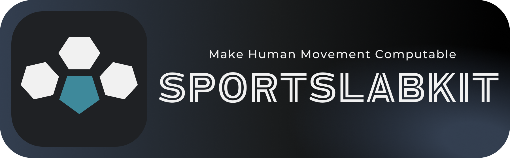
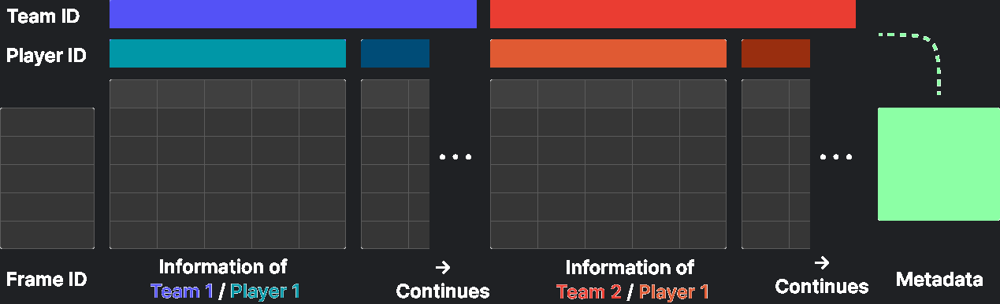
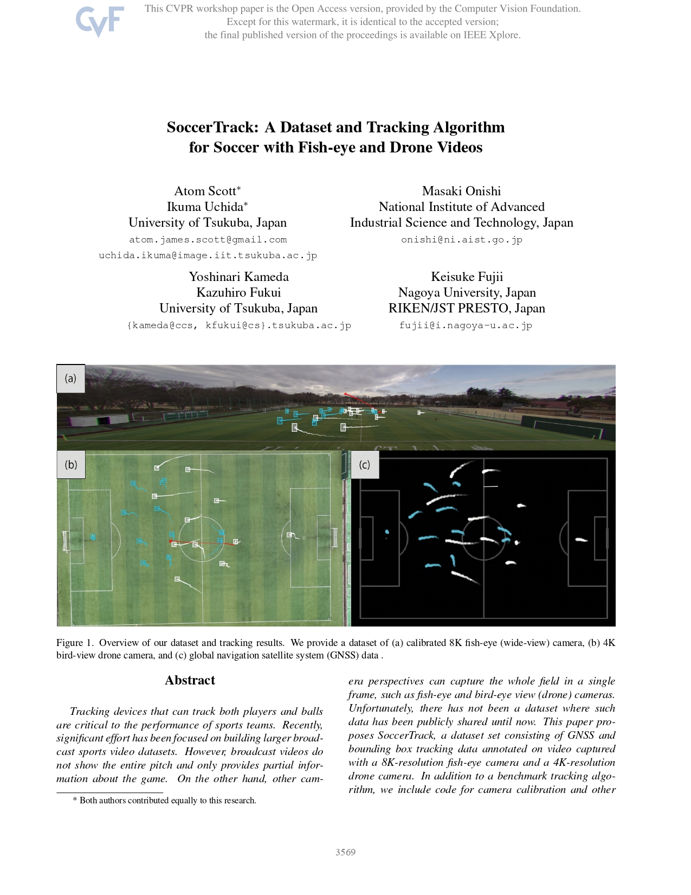

<div align="center">
  <p>
    <a align="center" href="" target="_blank">
      
    </a>
  </p>
  <br>

  [notebooks](https://github.com/atomscott/sportslabkit/notebooks) | [documentation](https://sportslabkit.readthedocs.io/) | [papers](https://scholar.google.com/citations?user=bjSLu7wAAAAJ&hl=en)

  <br>

  [](https://soccertrack.readthedocs.io/en/latest/?badge=latest) 
  [](https://www.kaggle.com/datasets/atomscott/soccertrack)
  [](https://paperswithcode.com/dataset/soccertrack-dataset)
  [](https://pypi.org/project/soccertrack/)

</div>

# SportsLabKit

## Introduction

Meet SportsLabKit: The essential toolkit for advanced sports analytics. Designed for pros and amateurs alike, we convert raw game footage into actionable data.

We're kicking off with soccer and expanding to other sports soon. Need to quantify your game? Make human movement computable with SportsLabKit.


## Features

### Core Capabilities
- **High-Performance Tracking**: In-house implementations of SORT, DeepSORT, ByteTrack, and TeamTrack for object tracking in sports.

### Flexibility
- **Plug-and-Play Architecture**: Swap out detection and ReID models on the fly. Supported models include YOLOv8 and torch-ReID.

### Usability
- **2D Pitch Calibration**: Translate bounding boxes to 2D pitch coordinates.
  
- **DataFrame Wrappers**: `BoundingBoxDataFrame` and `CoordinatesDataFrame` for effortless manipulation and analysis of tracking data.

### Tutorials
- [**Get Started**](./notebooks/01_get_started): Your first steps in understanding and setting up SportsLabKit.
- [**User Guide**](./notebooks/02_user_guide): A comprehensive guide for effectively using the toolkit in real-world scenarios.
- [**Core Components**](./notebooks/03_core_components/): Deep dive into the essential elements that make up SportsLabKit, including tracking algorithms and DataFrame wrappers.

## Installation

To install SportsLabKit, simply run:

```bash
pip install SportsLabKit
```

> **Note**: We're in active development, so expect updates and changes.

## Example Usage

To get started with tracking your first game, follow this simple example:

```python
import sportslabkit as slk

# Initialize your camera and models
cam = slk.Camera(path_to_mp4)
det_model = slk.detection_model.load('YOLOv8x')
motion_model = slk.motion_model.load('KalmanFilter')

# Configure and execute the tracker
tracker = slk.mot.SORTTracker(detection_model=det_model, motion_model=motion_model)
bbdf = tracker.track(cam)

# The tracking data is now ready for analysis
```

The output is a `BoundingBoxDataFrame`, a multi-level Pandas DataFrame that contains Team ID, Player ID, and various attributes like bounding box dimensions. Each row is indexed by Frame ID for easy analysis. The DataFrame is also customizable, allowing you to adapt Team and Player IDs as needed.



## Roadmap

- **Better CV tools**: Implement state of the art tracking methods, add event detection etc.

- **Unified Data Representation**: In the pipeline are event data detection and a single DataFrame structure for both event and trajectory data.
  
- **Enhanced Compatibility**: Upcoming support for data export to standard formats for easy integration with other tools.


## Contributing

See the [Contributing Guide](./contributing.md) for more information.


## Contributors

<!-- ALL-CONTRIBUTORS-BADGE:START - Do not remove or modify this section -->
[](#contributors-)
<!-- ALL-CONTRIBUTORS-BADGE:END -->

<!-- ALL-CONTRIBUTORS-LIST:START - Do not remove or modify this section -->
<!-- prettier-ignore-start -->
<!-- markdownlint-disable -->
<table>
  <tbody>
    <tr>
      <td align="center" valign="top" width="14.28%"><a href="https://atomscott.me/"><br /><sub><b>Atom Scott</b></sub></a><br /><a href="#maintenance-AtomScott" title="Maintenance">🚧</a></td>
      <td align="center" valign="top" width="14.28%"><a href="https://github.com/IkumaUchida"><br /><sub><b>Ikuma Uchida</b></sub></a><br /><a href="#tutorial-IkumaUchida" title="Tutorials">✅</a></td>
    </tr>
  </tbody>
</table>

<!-- markdownlint-restore -->
<!-- prettier-ignore-end -->

<!-- ALL-CONTRIBUTORS-LIST:END -->

This project follows the [all-contributors](https://github.com/all-contributors/all-contributors) specification. Contributions of any kind welcome!


## Related Papers

<table>
<td width=30% style='padding: 20px;'>
<a href="https://openaccess.thecvf.com/content/CVPR2022W/CVSports/papers/Scott_SoccerTrack_A_Dataset_and_Tracking_Algorithm_for_Soccer_With_Fish-Eye_CVPRW_2022_paper.pdf">

</a>
</td>
<td width=70%>
  <p>
    <b>SoccerTrack:</b><br>
    A Dataset and Tracking Algorithm for Soccer with Fish-eye and Drone Videos
  </p>
  <p>
    Atom Scott*, Ikuma Uchida*, Masaki Onishi, Yoshinari Kameda, Kazuhiro Fukui, Keisuke Fujii
  </p>
  <p>
    <i> Presented at CVPR Workshop on Computer Vision for Sports (CVSports'22). *Authors contributed equally. </i>
  </p>
  <div>
    <a href='https://openaccess.thecvf.com/content/CVPR2022W/CVSports/papers/Scott_SoccerTrack_A_Dataset_and_Tracking_Algorithm_for_Soccer_With_Fish-Eye_CVPRW_2022_paper.pdf'>
      
    </a>
    <a href='https://github.com/AtomScott/SoccerTrack'>
      
    </a>
    <a href='https://soccertrack.readthedocs.io/'>
      
    </a>
  </div>
</td>
</table>

See papers that cite SoccerTrack on [Google Scholar](https://scholar.google.com/scholar?oi=bibs&hl=en&cites=13090652901875753929).
## Citation

```
@inproceedings{scott2022soccertrack,
  title={SoccerTrack: A Dataset and Tracking Algorithm for Soccer With Fish-Eye and Drone Videos},
  author={Scott, Atom and Uchida, Ikuma and Onishi, Masaki and Kameda, Yoshinari and Fukui, Kazuhiro and Fujii, Keisuke},
  booktitle={Proceedings of the IEEE/CVF Conference on Computer Vision and Pattern Recognition},
  pages={3569--3579},
  year={2022}
}
```
